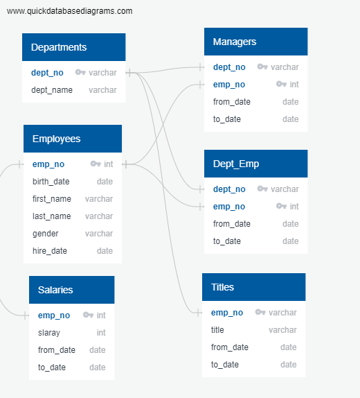
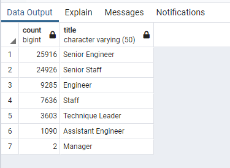

# Pewlett-Hackard-Analysis
## Overview of Analysis:
### In this analysis of HP's database, we were able to help improve the data information for the company on how many workers will be retiring from their company We were able to break down six CSV files and insert them into clean new data tables. Using something similar to the structure below, the data was easy to move around and put into a better format.

### Results:
* The data showed that there was a large amount of retirements could be on the horizon for the company in the next few years. There was slightly over 1500 employees included in the mentorship program as well. The number of jobs that could be successful here are quite high. 
### Summary:

### Summary:
* How many roles will need to be as the "silver tsunami" begins to make an impact?
    * There are over 72k positions that need to be filled as of the retirements coming at Pewlett-Hackard. See the figure below. 
    
    

* Are there enough qualified, retirement-ready employees in the departments to mentor the next generation of Pewlett Hackard employees? 
    * Yes, there should be enough employees to mentor the upcoming generation of employees. The company is working hard to make sure there are plenty of mentors. With the amount of senior positions that will need to be filled, you will see a good turnover the exisiting base of employees. 